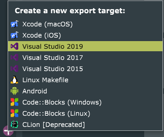

<!-- PROJECT LOGO -->
 

  
  

    <i>An image sonification plugin made with JUCE</i>
  

<!-- TABLE OF CONTENTS -->

  
Table of Contents

  <ol>
    <li>
      <a href="#about-the-project">About The Project</a>
    </li>
    <li>
      <a href="#getting-started">Getting Started</a>
      <ul>
        <li><a href="#prerequisites">Prerequisites</a></li>
        <li><a href="#compile-the-project">Compile the project</a></li>
      </ul>
    </li>
    <li><a href="#license">License</a></li>
    <li><a href="#acknowledgements">Acknowledgements</a></li>
  </ol>

<!-- ABOUT THE PROJECT -->
## About The Project

https://user-images.githubusercontent.com/1530307/123632054-c243c200-d817-11eb-9a74-1f954395fc1e.mp4

SonicMage started as an experimental project that I used to learn the JUCE framework and audio programming in general.

It can be seen as an additive synthesizer the matches the pitch of the partials to the color of the pixels under the scanning line. Blue pixels create high pitches while red pixels create low pitches. The brightness of the pixel defines the volume of the corresponding partial.

### Built With
* [JUCE](https://juce.com/)

## Getting Started
### Prerequisites

To compile this project you only need the JUCE framework with the Projucer and your favourite C++ compiler/IDE.
You can get JUCE [here](https://juce.com/get-juce). 

### Compile the project

1. Clone the repository.
2. Open `SonicMage.jucer` with the projucer.
3. Add a new exporter.  
   
4. Select the exporter and open the project.  
   
5. Compile.

You should compile with the `Release` configuration to benefit from the compiler optimizations. Compiling in `Debug` mode will probably cause audio glitches.

### How to use

You don't have to open an image to produce sound with SonicMage but you will only hear a basic sine wave at the fundamental of the note you press.
To add partials just click the button on the top left and choose an image!

You can control the behaviour of the sonification process with the following parameters :

| Parameter           | Description                                                                                                                   |
|---------------------|-------------------------------------------------------------------------------------------------------------------------------|
| Scan Position       | Changes the position of the scanline.                                                                                         |
| Partials            | Controls the amount of partials added to the fundamental.                                                                     |
| Harmonicity         | Controls the harmonicity of the partials, all the way up = all partials are quantized to the harmonics of the fundamental.    |
| Pluck               | Adds more or less partials to the start of the sound to create a plucky effect. Can be disabled.                              |
| A,D,S and R         | Control the output envelope.                                                                                                |

## License
Distributed under the GPL-3.0 License. See `LICENSE` for more information.

## Acknowledgements
* [JUCE](https://juce.com)
* [Fira Sans](https://github.com/bBoxType/FiraSans)
* [Demo Picture](https://www.pexels.com/photo/gray-and-black-galaxy-wallpaper-2150/)

